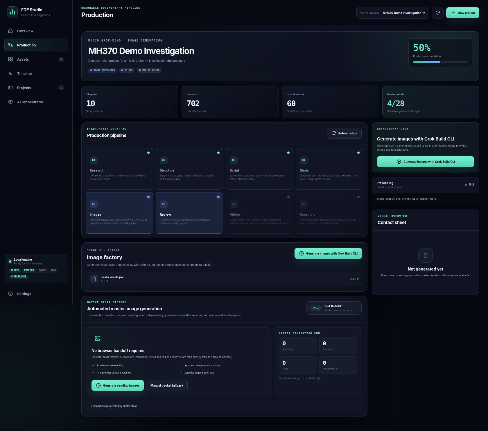

# Failure Documentary Engine

A local, human-reviewed production pipeline for air-crash investigations, engineering failures, industrial disasters, cyber incidents, and other documentary stories.

It turns a story brief into:

1. Research dossier and claim ledger
2. Approved documentary structure
3. Detailed narration script
4. 45–60 shot divisions
5. At most 28 reusable master assets
6. Image prompts and a 4×7 contact sheet
7. Scene-level image/video review and regeneration
8. Grok-ready image-to-video jobs
9. Imported five-second clips and reusable variants
10. A narration-driven preview and picture-locked base video

Music and final sound design are intentionally outside this phase.

## AI Orchestrator and native media generation

Studio v0.5 routes 17 reasoning, media, audio, assembly and rendering tasks by explicit capability. Grok Build CLI can now execute structured tasks, generate master images and animate approved references without a browser handoff. HyperFrames provides the frame-accurate HTML renderer, with resumable timeline-aligned chunks and FFmpeg fallback.

Open **AI Orchestrator** to select any compatible provider/model for each task. The included Custom CLI Adapter lets future structured or media models join the pipeline without changing its stage code.

See [`docs/AI_ORCHESTRATOR.md`](docs/AI_ORCHESTRATOR.md) and [`docs/GROK_CLI_HYPERFRAMES.md`](docs/GROK_CLI_HYPERFRAMES.md).


## What is implemented

- Typer CLI and persisted project state machine
- Pydantic JSON contracts
- Capability-routed structured, image, video, audio and render providers
- Native Grok Build CLI adapter for reasoning, images and image-to-video
- Cross-provider retries and fallbacks through one routed structured agent
- Structure/script/shot prompt packs
- Deterministic asset compression with a hard maximum
- Image prompt generation
- High-resolution PNG/PDF/HTML contact sheets
- Modern FastAPI SaaS-style production studio
- Per-asset review, versioning, and dependency invalidation
- Image/video inbox import and validation
- Grok-ready video-job manifests and automated reference-safe clip generation
- Inspectable HyperFrames HTML compositions driven by `hf-seek`
- Resumable timeline-aligned HyperFrames render chunks with FFmpeg fallback
- FFmpeg footage variants, timeline assembly, preview, and final-base muxing
- Offline test suite and demo project generator

## Requirements

- Python 3.10+
- FFmpeg + ffprobe for video processing and fallback rendering
- Node.js 22+ and npm for the pinned HyperFrames runtime
- Grok Build CLI when using native Grok reasoning or Imagine media
- Any configured CLI provider used by your selected routes

## Install

```bash
cd failure-documentary-engine
python3 -m venv .venv
source .venv/bin/activate          # Windows: .venv\Scripts\activate
pip install -e ".[dev]"
npm install
```

Authenticate only the subscription-backed CLIs you plan to use, for example:

```bash
grok login
codex login
claude
```

Check external tools:

```bash
fde doctor
```

## Modern Studio UI

Version 0.5 includes the complete local SaaS-style production control room, capability-aware AI Orchestrator, native media factory and deterministic browser-rendering workflow.



Start it with:

```bash
fde studio
```

Or double-click `run_studio.command` on macOS. Windows users can run `run_studio_windows.bat`.

The Studio provides:

- project creation from a story idea;
- an eight-stage resumable production pipeline;
- asynchronous local jobs and live logs;
- structure and script approval gates;
- automatic Grok CLI image/video generation with resumability;
- ChatGPT/Grok UI packets and ZIP import as compatible manual fallbacks;
- modern image/video asset review with selective regeneration notes;
- narration upload, timeline assembly, preview, and picture lock;
- persistent per-task provider/model mapping, prompt packs, retries and fallbacks;
- HyperFrames/FFmpeg renderer selection and local readiness checks.

See [`docs/STUDIO_UI.md`](docs/STUDIO_UI.md) for the operator guide.

## Fast demo

This uses a deterministic offline mock agent and creates placeholder images, so no API is required:

```bash
fde demo mh370-demo
fde status mh370-demo
fde contact-sheet mh370-demo
fde studio --project-id mh370-demo --port 8765
```

Open `http://127.0.0.1:8765`.

## Start a real project

```bash
fde init mh370 \
  --title "MH370: The Plane That Vanished" \
  --topic "The disappearance of Malaysia Airlines Flight MH370" \
  --duration 480 \
  --max-assets 28
```

### Agent modes

#### 1. Manual mode — safest default

```bash
fde research mh370 --agent manual
```

The engine writes a prompt and expected schema into the project’s `_requests` folder. Run that prompt in Codex or another LLM, save the returned JSON at the requested path, then rerun with `--consume-response`.

#### 2. Mock mode — testing only

```bash
fde research mh370 --agent mock
fde structure mh370 --agent mock
fde script mh370 --agent mock
fde shots mh370 --agent mock
```

#### 3. Configurable command agent

Set a command template that reads the prompt file and writes the output file:

```bash
export FDE_LLM_COMMAND='codex exec --skip-git-repo-check --output-last-message {output} - < {prompt}'
fde structure mh370 --agent command
```

`{prompt}` and `{output}` are shell-quoted by the engine. CLI flags can change between Codex releases, so this command is deliberately configurable rather than hard-coded.

## State-aware runner

`fde run PROJECT --agent manual` advances every automatic stage and stops at the next manual review or generation gate. Rerun it after completing that gate.

## Recommended production flow

```bash
fde research mh370 --agent manual
fde structure mh370 --agent manual
fde approve-stage mh370 structure
fde script mh370 --agent manual
fde approve-stage mh370 script
fde shots mh370 --agent manual
fde optimize-assets mh370 --max-assets 28
fde generate-image-prompts mh370
fde contact-sheet mh370
fde review mh370
```

With Grok CLI selected for the image and video tasks, generation is automatic and resumable:

```bash
fde generate-media mh370 image
fde contact-sheet mh370
# approve images in Studio
fde validate-assets mh370
fde video-jobs mh370
fde generate-media mh370 video
# approve videos in Studio
```

To regenerate only exceptions:

```bash
fde generate-media mh370 image --asset-ids A07,A12 --force
fde generate-media mh370 video --asset-ids A07 --force
```

Manual ChatGPT/Grok UI or external-tool workflows remain supported through production-packet export and the image/video inboxes.

Then continue:

```bash
# approve videos in the dashboard or CLI, then:
fde validate-videos mh370
fde create-variants mh370
fde import-narration mh370 path/to/narration.wav --timestamps path/to/timestamps.json
fde build-timeline mh370
fde render-preview mh370
fde render-final-base mh370
```

## Review from CLI

```bash
fde review-asset mh370 A07 approved
fde review-asset mh370 A12 change_requested \
  --instruction "Make the aircraft smaller and preserve the night lighting."
fde regenerate-asset mh370 A12
```

Changing A12 invalidates only A12’s image approval, video job, imported video approval, generated variants, and linked timeline entries.

## File layout

```text
projects/<project-id>/
├── 00_input/
├── 01_research/
├── 02_structure/
├── 03_script/
├── 04_shot_plan/
├── 05_master_assets/
├── 06_contact_sheet/
├── 07_review/
├── 08_generated_images/
├── 09_video_jobs/
├── 10_generated_videos/
├── 11_narration/
├── 12_timeline/
├── 13_preview/
├── 14_final/
└── _requests/
```

## Timestamps format

Optional narration timestamps should be JSON:

```json
[
  {"narration_id": "NAR_001", "start": 0.0, "end": 6.2},
  {"narration_id": "NAR_002", "start": 6.2, "end": 12.7}
]
```

Without timestamps, the timeline uses script estimates.

## Safety and editorial quality

The engine is designed to distinguish confirmed facts from disputed theories. It provides data contracts and review gates, but the producer remains responsible for source quality, rights, defamation risk, and final factual verification.

## Documentary Image Factory (ChatGPT Plus UI)

Version 0.2 adds a low-interaction bridge to a private Custom GPT. The local engine prepares one production packet; the GPT generates images through ChatGPT's Image Generation capability; the engine imports and normalizes the returned batch.

### One-time Custom GPT setup

Open `gpt_factory/docs/SETUP_IN_5_MINUTES.md`. The ready-to-copy configuration is in:

- `gpt_factory/GPT_CONFIG.json`
- `gpt_factory/GPT_INSTRUCTIONS.md`
- `gpt_factory/knowledge/`

Enable **Image Generation** and **Code Interpreter & Data Analysis**, then keep the GPT private.

### Export a project packet

After the shot plan, asset optimization, and prompt generation stages:

```bash
fde export-image-factory mh370
```

This creates:

```text
projects/mh370/07_review/
├── image_factory_packet/
└── mh370_image_factory_packet.zip
```

Upload the four files listed in `UPLOAD_README.md` to the private GPT and paste the command in `RUN_INSTRUCTIONS.md`.

### Import the returned image ZIP

```bash
fde import-image-batch mh370 ~/Downloads/mh370_images_approved.zip
```

The importer safely extracts the ZIP, maps files by the `A01`/`A02` prefix, converts supported landscape images to 1600×900 PNG, and runs the normal project validation/import path.

> Product limitation: ChatGPT may generate the images successfully but may not always expose those generated image files to Code Interpreter for automatic ZIP creation. The factory instructions report that limitation honestly. The fallback is to download the generated images, zip them locally, and use the same import command.
